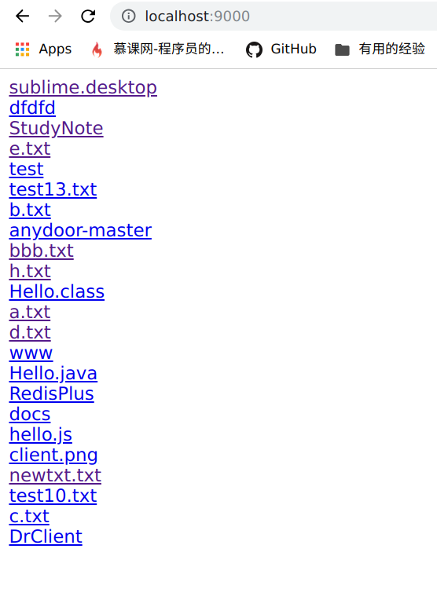

# fileshare
一个使用java语言开发的轻量级静态资源服务器

# 使用方法

可以自己打成jar包或者直接使用archive/fileshare-1.0.jar

输入命令启动服务器
```
java -Dport=9000 -DpoolSize=2000 -Droot=/home/ly/Desktop -jar fileshare-1.0.jar
```
三个参数的意义分别为：  
port: 启动端口  
poolSize: 服务器最大使用线程数   
root: 准备设置为静态服务根目录的路径    

root参数必须指定，其余参数可选   

启动效果如下：   

